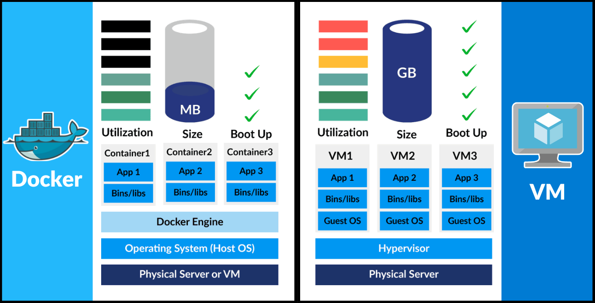

# Docker 🐳

Note-taking repository for Docker. 

## Why use Docker ?

- Compatibility/Dependency
- Different dev/test/prod environments
- Long setup time

## What can Docker do ?

- Containerize applications
- Run each service with its own dependencies/libraries in separate containers

## What are containers ?

- Containers are **completely isolated environments**
- Containers have their own processes, services, network interfaces, mounts, etc..
- Containers share the same OS kernel

*Docker, which launched in 2013, initially utilized LXC to provide an easier way to create, deploy, and run applications using containers.  Docker quickly evolved from using LXC as its default execution environment by developing its own container runtime, ```libcontainer```, which now powers Docker containers.*

## Sharing the Kernel

You can't run a Windows based container on a Docker Host with Linux on it. You need Docker Host on Windows Server.

**NOTE. When you install Docker on Windows and run a Linux container on Windows, Windows run a Linux container on a Linux virtual machine.**

Unlike hypervisors, Docker is not meant to virtualize and run different operating systems and kernels on the same hardware. The main purpose of Docker is to package/containerize applications and to ship them to run anywhere.

## Containers vs Virtual Machines

Docker has less isolation as more resources are shared between the containers like kernel, whereas VMs have complete isolation from each other.



## Containers vs Images

An image is a package (or a template) used to create one or more containers. Containers are running instances of images that are isolated and have their own environments and set or processes.


